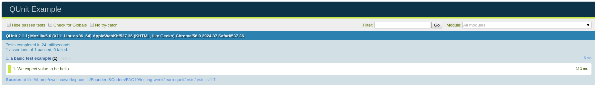

# Learn QUnit

A quick introduction to JavaScript unit testing with QUnit.js for complete beginners! 

## What is testing?  
## Why is it good?
## How to use it?

## What is Qunit?

The official description on http://qunitjs.com/ is:

> QUnit is a powerful, easy-to-use JavaScript unit testing framework.
  It's used by the jQuery, jQuery UI and jQuery Mobile projects and is capable of testing any generic JavaScript code.

### Setup

To use QUnit, you only need to include two QUnit files on your HTML page.   
QUnit consists of  **qunit.js**, the test runner and testing framework, and **qunit.css**, which styles the test suite page to display test results.

The contents of qunit.html:

```html
<!DOCTYPE html>
<html>
<head>
  <meta charset="utf-8">
  <meta name="viewport" content="width=device-width">
  <title>QUnit Example</title>
  <link rel="stylesheet" href="https://code.jquery.com/qunit/qunit-2.1.1.css">
</head>
<body>
  <div id="qunit"></div>
  <div id="qunit-fixture"></div>
  <script src="https://code.jquery.com/qunit/qunit-2.1.1.js"></script>
  <script src="tests.js"></script>
</body>
</html>
```
The contents of tests.js:

```javascript
QUnit.test( "a basic test example", function (assert) {
  var value = "hello";
  assert.equal( value, "hello", "We expect value to be hello" );
});
```

The result:




### Assertions

The **equal** assertion uses the simple comparison operator (**==**) to compare the actual and expected arguments.
When they are equal, the assertion passes; otherwise, it fails.

**equal( actual, expected [, message ] )**

Example:

```javascript
QUnit.test( "equal test", function (assert) {
  assert.equal( 0, 0, "Zero, Zero; equal succeeds" );
});

```
